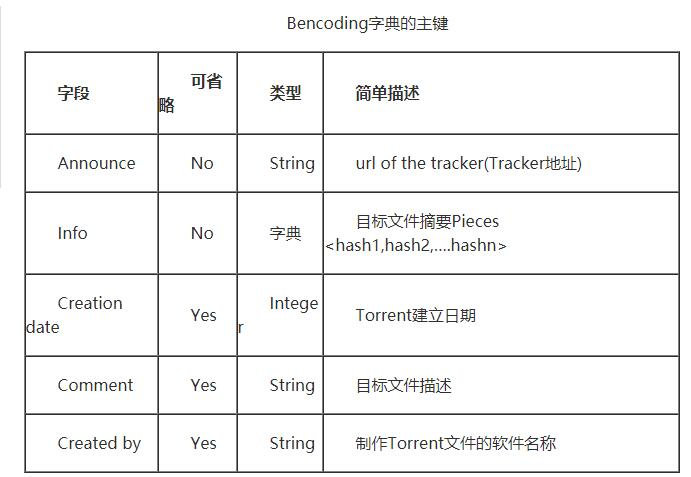
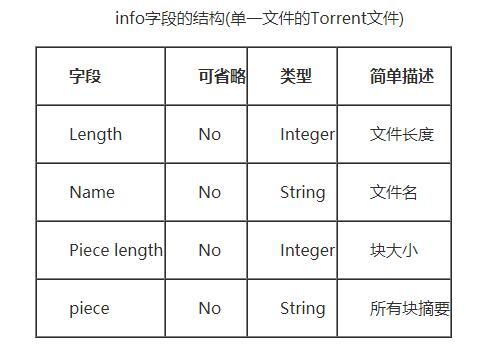
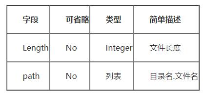

# 分布式系统大作业

（二）、Bittorrent客户端

目标：

1、实现一个简易的Bittorrent客户端

2、实现对.torrent文件的解析

3、实现与Tracker交互获得peer的IP和端口

4、实现从peer获取pieces，可不实现unchoking激励机制，piece选择策略可选用简单的随机或者顺序策略

5、编写测试程序，进行测试验证

## bencoding编码

单文件的torrent文件info字段

多文件的torrent文件info字段中的Length变成files dict

